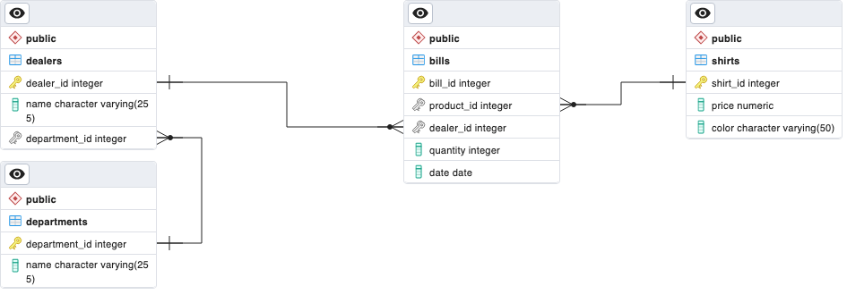

# Ejercicios SQL - Joins-queries-avanzadas
Con estos ejercicios vamos a practicar cómo realizar queries combinando distintas tablas.

## Instrucciones
Deberás `forkear` este repositorio y clonarlo en tu ordenador.

1. En primer lugar, crea una base de datos y, siguiendo este `ERD`, crea las tablas correspondientes: `bills`, `dealers`, `departments` y `shirts`.
2. En este mismo repositorio encontrarás cuatro archivos `csv` que puedes usar para importar los datos a cada tabla.
3. Resuelve los ejercicios y guarda cada query en el `SOLUTION.md` que encontrarás en el repo.
4. Súbelo a GitHub y haz una pull request al repositorio principal.

## Ejercicios
1. Muestra `color` y `cantidad total (total_amount)` de camisetas vendidas.
2. Muestra `color`, `cantidad total (total_amount)` y `precio total (total_price)` de camisetas vendidas.
3. Muestra `nombre del delaer` y `cantidad total (total_sales)` de camisetas que ha vendido cada dealer.
4. Muestra `nombre del dealer`, `cantidad total (total_sales)` y `precio total (total_price)` de camisetas que ha vendido cada dealer.
5. Muestra cuántas camisetas de cada color ha vendido `Blondy Lacelett`.
6. Muestra cuántas camisetas ha vendido cada departamento, y cuánto dinero ha ganado en total.
7. Muestra cuántas camisetas se han vendido desde el `01/06/2023` al `15/06/2023`.
8. Muestra cuántas camisetas de cada color y por qué cantidad se han vendido en los últimos `10` días de `junio`.
9. Muestra cuántas camisetas de cada color ha vendido el departamento `North`.
10. Muestra cuántas facturas ha emitido el departamento `South` en las últimas `2 semanas` de `junio`.
